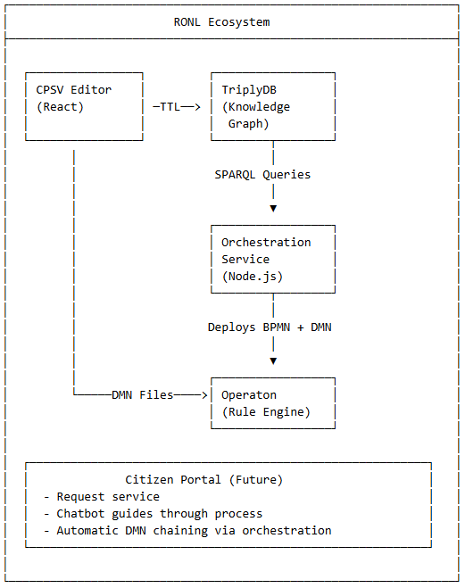

# Linked Data Explorer

> A React-based SPARQL visualization and query tool for exploring Dutch Government Data (Regels Overheid)

[](https://linkeddata.open-regels.nl)
[](https://www.typescriptlang.org/)
[](https://react.dev/)
[](https://vitejs.dev/)
[](https://nodejs.org/)
[](https://expressjs.com/)


---

# Vendor Service Integration ✨ NEW ✨

## Overview

The Vendor Services feature enables discovery and management of commercial implementations of government decision models. While government agencies publish reference DMN implementations through RONL, vendors (like Blueriq, Oracle Policy Automation, etc.) may provide certified commercial implementations with additional features, support, and integration capabilities.

### Purpose

- **Discoverability:** Users can see which DMNs have commercial implementations available
- **Transparency:** Clear information about vendor implementations, licensing, and access requirements
- **Choice:** Enable organizations to choose between reference implementations and vendor services
- **Ecosystem Growth:** Support multi-vendor implementations of government services

### Key Features

✅ Visual badges showing vendor implementation count per DMN  
✅ Detailed vendor information modal with provider details  
✅ Contact information and service URLs  
✅ License type and access requirement indicators  
✅ Logo display for vendor branding  
✅ Integration with CPSV Editor for publishing vendor services

### References
See further the [detailed docs](./docs/VENDOR_SERVICES.md)

---

# DMN Governance & Validation System 

**Version:** 0.8.3  
**Release Date:** February 14, 2026  
**Status:** Production  
**Ontology:** RONL Ontology v1.0

## Overview

The Linked Data Explorer implements a visual governance system that distinguishes between validated, in-review, and non-validated Decision Model and Notation (DMN) models published to TriplyDB. This transparency enables users to quickly identify which decision models have been officially approved by competent Dutch government authorities.

### Purpose

- **Trust & Transparency:** Clearly indicate which DMNs have undergone official validation
- **Quality Assurance:** Track validation status, validating organization, and validation dates
- **Compliance:** Support audit trails for government rule implementations
- **Multi-Authority Support:** Enable validation by different competent authorities (SVB, SZW, UWV, etc.)

### References
See further the [detailed docs](./docs/GOVERNANCE.md)

---

# Enhanced Validation & Semantic Chain Detection

## Overview

The Linked Data Explorer implements a sophisticated validation system that distinguishes between two types of DMN chains:

1. **DRD-Compatible Chains**: All variables match by exact identifier, enabling deployment as unified Decision Requirements Diagrams in Operaton
2. **Sequential Chains**: Variables match semantically via `skos:exactMatch` relationships, requiring sequential API execution with runtime variable mapping

### Features

The enhanced validation system successfully distinguishes between DRD-compatible and semantic chains through:

- **Robust SPARQL querying** with type checking and shared concept detection
- **React state management** with proper dependency tracking
- **Comprehensive test data** validating semantic-only chains
- **Detailed debugging** revealing critical RDF data integrity requirements

### References
See further the [detailed docs](./docs/ENHANCED_VALIDATION.md)

---

# DRD (Decision Requirements Diagram) Generation

## Overview

The DRD Generation feature enables users to save multi-DMN chains as single, executable Decision Requirements Diagrams (DRDs) deployed to Operaton. This transforms sequential chain execution (multiple API calls) into unified DRD evaluation (single API call), improving performance by ~50% while maintaining semantic integrity.

**Key Benefits:**
- **Performance:** Single Operaton call vs. multiple sequential API calls
- **Semantics:** Proper DMN 1.3 `<informationRequirement>` wiring
- **Reusability:** Save complex chains as named templates
- **Portability:** DRD XML can be exported, versioned, shared (Phase 2)
- **Simplicity:** Users work with familiar chain building UI

### References
See further the [detailed docs](./docs/DRD_GENERATION.md)

---

### BPMN Process Modeler (v0.7.0)

The BPMN Modeler features full Camunda/Operaton property editing via the official `bpmn-js-properties-panel`, replacing the previous custom panel. Select any element to edit its complete set of technical properties including async continuations, input/output mappings, execution listeners, and extension properties.

**DMN Linking**: When selecting a `BusinessRuleTask`, a *Link to DMN* dropdown appears at the bottom of the properties panel. It lists all DMN decision models available on the active TriplyDB endpoint. Selecting a DMN automatically populates `camunda:decisionRef`, `camunda:resultVariable`, and `camunda:mapDecisionResult`. Linked tasks display a blue badge on the canvas showing the decision reference, centered on the element and visible at a glance without clicking.

**v0.6.0 (2026-02-07)**
- Initial BPMN Modeler implementation
- Three-panel layout with process management
- Tree Felling Permit example auto-loading
- localStorage persistence
- Export functionality
- Custom zoom controls and scroll-to-zoom
- Properties panel basic implementation

### References
See further the [detailed docs](./docs/BPMN-MODELER-IMPLEMENTATION.md)  
Check the [roadmap document](./docs/ROADMAP.md) for development priorities and next steps.

---

### Semantic Analysis (v0.6.2)

The **Semantic Analysis** tab in the Chain Builder detects relationships between DMN variables across different government agencies using NL-SBB-compliant `skos:exactMatch` links — even when variables have different names or labels.

This enables cross-agency chain composition that exact identifier matching alone cannot discover.

#### How It Works

The CPSV Editor generates a `skos:Concept` for each DMN input and output variable. When two variables from different agencies mean the same thing, both concepts share the same `skos:exactMatch` URI pointing to a shared vocabulary term (e.g., `https://begrippen.regels.overheid.nl/concept/geboortedatum`).

The Linked Data Explorer queries these relationships and surfaces them in three backend endpoints:

| Endpoint | Description |
|---|---|
| `GET /api/dmns/semantic-equivalences` | Variable pairs that share the same `skos:exactMatch` URI |
| `GET /api/dmns/enhanced-chain-links` | Chain links via both exact identifier and semantic matching |
| `GET /api/dmns/cycles` | Circular dependencies detected via semantic links (3-hop) |

All endpoints accept the `?endpoint=` query parameter for dynamic TriplyDB dataset selection.

#### Usage

Open the **Chain Builder** view and click the **Semantic Analysis** tab. The view shows:

- **Semantic Equivalences** — variables from different DMNs that map to the same concept, with their labels, notations, and the shared concept URI
- **Semantic Chain Suggestions** — DMN output → input pairs connectable via a shared concept (not discoverable by identifier matching alone)
- **Counts** — breakdown of semantic matches vs exact matches found in the current endpoint

Results populate automatically when NL-SBB concepts with `skos:exactMatch` relationships are published to the active TriplyDB dataset from the CPSV Editor.

#### Graph View

In the SPARQL graph visualization, semantic links (`skos:exactMatch`, `dct:subject`) are rendered as **dashed green lines** (2.5px), visually distinct from standard RDF property links (solid grey, 1.5px).

#### Standards

- [NL-SBB](https://geonovum.github.io/NL-SBB/) — Dutch profile for SKOS concept schemes
- [SKOS](https://www.w3.org/2004/02/skos/) — `skos:exactMatch` for cross-vocabulary alignment
- [CPSV-AP 3.2.0](https://semiceu.github.io/CPSV-AP/releases/3.2.0/) — `cpsv:Input` / `cpsv:Output` linked via `dct:subject` to concepts

---

## 📋 Table of Contents

- [Architecture Overview](#-architecture-overview)
- [Overview](#-overview)
- [Features](#-features)
- [Live Deployments](#-live-deployments)
- [Technology Stack](#-technology-stack)
- [Project Structure](#-project-structure)
- [Getting Started](#-getting-started)
- [Development](#-development)
- [Code Quality](#-code-quality)
- [Deployment](#-deployment)
- [Usage Guide](#-usage-guide)
- [Contributing](#-contributing)
- [License](#-license)

---

## 🏗️ Architecture Overview

### Flow

User Question  
↓  
Chatbot (clarify intent)  
↓  
Question Analysis → Select relevant DMNs  
↓  
BPMN Orchestration Engine (Operaton)  
↓  
Sequential DMN Execution (gather inputs → execute → pass outputs)  
↓  
Legal Decision + Explanation

### Current Stack

```
Frontend (React + TypeScript)
         ↓ HTTPS/REST
Backend (Node.js + Express)
         ├→ TriplyDB (SPARQL)     - DMN discovery & metadata
         └→ Operaton (REST API)    - DMN execution engine
                  ↓
            DMN Models (Decision Models)
```



## 🎯 Overview

**Linked Data Explorer** is a web application for visualizing and querying SPARQL endpoints, with specialized support for DMN (Decision Model and Notation) orchestration. Built as part of the **Regels Overheid Nederland (RONL)** initiative, it enables discovery and exploration of government decision models using Linked Data principles.

### What It Does

- **Discover DMNs** - Browse available Decision Models from TriplyDB
- **Dynamic Endpoints** - Switch between multiple TriplyDB datasets in real-time
- **Build Chains** - Drag-and-drop interface for creating DMN execution sequences
- **Execute Chains** - Run sequential DMN workflows with automatic variable orchestration
- **Export Chains** - Save configurations as JSON or BPMN 2.0 diagrams
- **Visualize Data** - Interactive graph visualization of SPARQL query results
- **Query Editor** - Execute custom SPARQL queries with syntax highlighting
---

## ✨ Features

### 1. SPARQL Query Editor

<details>
<summary>View Features</summary>

- **Syntax Support** - SPARQL 1.1 query execution
- **Sample Query Library** - Pre-built queries for DMN discovery and testing
- **Multiple Endpoints** - Switch between TriplyDB, local, and custom endpoints
- **Results Table** - Formatted display with column headers and data types
- **Graph Visualization** - Interactive D3.js force-directed graphs for RDF triples
- **CORS Proxy** - Automatic fallback for public endpoints

</details>

### 2. DMN Discovery

<details>
<summary>View Features</summary>

- **Automatic Discovery** - Query TriplyDB for available DMN models using CPRMV vocabulary
- **Search & Filter** - Real-time search across DMN names and identifiers
- **Variable Inspection** - View input variables (blue) and output variables (green) with types
- **Type Support** - Integer, String, Boolean, Date variable types
- **Chain Detection** - Automatically identify DMN relationships based on variable matching
- **Three-Panel Layout** - DMN list, chain composer, and configuration panels

</details>

### 3. DMN Orchestration Backend

<details>
<summary>View Features</summary>

- **Dynamic Endpoint Selection** - Switch between TriplyDB datasets without page reload
- **Intelligent Caching** - Backend caches DMN metadata per endpoint (5-minute TTL)
- **Connection Indicators** - Visual status showing direct vs proxied connections
- **Drag-and-Drop Chain Building** - Visual composer for creating DMN sequences
- **Smart Validation** - Real-time validation with data flow analysis
- **Variable Orchestration** - Automatic input/output mapping between DMNs
- **Template System** - Pre-configured chains with test data
- **Chain Export** - Export as JSON or BPMN 2.0 diagrams

</details>

### 4. Chain Builder UI

<details>
<summary>View Features</summary>

- **Drag-and-Drop Interface** - Intuitive chain building with visual DMN cards
- **Real-Time Validation** - Instant feedback on required inputs and chain validity
- **Smart Input Forms** - Dynamic form generation based on DMN input variables
- **Test Data Filling** - One-click test data insertion for rapid testing
- **Execution Engine** - Execute chains directly from the UI with live progress tracking
- **Results Display** - View final outputs, intermediate results, and execution timing
- **Chain Configuration** - Configure and reorder DMNs with visual feedback

</details>

### 5. Chain Export

<details>
<summary>View Features</summary>

- **Export Formats**: JSON and BPMN 2.0
- **Filename Customization**: Edit filename before export via modal dialog
- **Format Selection**: Choose between JSON (chain configuration) or BPMN (process diagram)
- **Validation**: Export only enabled for valid chains
- **Operaton Integration**: BPMN exports use Operaton namespace (open-source Camunda fork)
- **Metadata Preservation**: DMN IDs, titles, and descriptions included in exports
- **BPMN 2.0 Compliance**: Proper extensionElements structure, no warnings in modelers
- **Timestamped Files**: Automatic timestamp addition to prevent overwrites

</details>

### 6. Tutorial System

<details>
<summary>View Features</summary>

- **In-app tutorial system** - 5 comprehensive guides (36 total steps)
- **Quick Start** - Heusdenpas Chain Demo - Step-by-step first execution (10 steps)
- **Building Chains Manually** - Drag-and-drop workflow guide (7 steps)
- **Understanding DMN Models** - Decision model concepts explained (6 steps)
- **Advanced Features** - SPARQL, graphs, performance monitoring (7 steps)
- **Troubleshooting Guide** - Common issues and solutions (6 steps)
- **Accordion navigation** - only one tutorial open at a time
- **Auto-scroll behavior** - tutorials automatically position at top when opened

</details>

### 7. Changelog

<details>
<summary>View Features</summary>

- **Version Tracking** - Complete history of features and improvements
- **JSON-Configurable** - Update `changelog.json` without code changes
- **Collapsible Sections** - Organized by version with expandable details
- **Visual Status Badges** - Color-coded release types

</details>

### 8. Settings & Configuration

<details>
<summary>View Features</summary>

- **Endpoint Management** - Add, remove, and switch between SPARQL endpoints
- **Session-Based** - Configuration resets on browser refresh (no persistent storage)
- **Preset Endpoints** - Pre-configured access to:
  - TriplyDB datasets
  - Regels Overheid SPARQL endpoint
  - Local development endpoints

</details>

---

## 🌐 Live Deployments

### Frontend

| Environment | URL | Branch | CI/CD | Purpose |
|-------------|-----|--------|-------|---------|
| **Production** | [linkeddata.open-regels.nl](https://linkeddata.open-regels.nl) | `main` | GitHub Actions ✅ | Stable release |
| **Acceptance** | [acc.linkeddata.open-regels.nl](https://acc.linkeddata.open-regels.nl) | `acc` | GitHub Actions ✅ | Testing environment |

**Platform:** Azure Static Web Apps  
**Deployment:** Automated via GitHub Actions on push  
**Build Command:** `npm run build:prod` (production) / `npm run build:acc` (acceptance)

### Backend

| Environment | URL | Branch | CI/CD | Purpose |
|-------------|-----|--------|-------|---------|
| **Production** | [backend.linkeddata.open-regels.nl](https://backend.linkeddata.open-regels.nl) | `main` | GitHub Actions ✅ | API & orchestration |
| **Acceptance** | [acc.backend.linkeddata.open-regels.nl](https://acc.backend.linkeddata.open-regels.nl) | `acc` | GitHub Actions ✅ | Testing environment |

**Platform:** Azure App Service (Linux, Node.js 22)  
**Deployment:** Automated via GitHub Actions with manual approval for production  
**Build Process:** TypeScript compilation, dependency installation, automated health checks

---


## 🛠️ Technology Stack

### Frontend

| Technology         | Version | Purpose                    |
| ------------------ | ------- | -------------------------- |
| **React**          | 19.2.3  | UI framework               |
| **TypeScript**     | 5.8.2   | Type-safe JavaScript       |
| **Vite**           | 6.2.0   | Build tool & dev server    |
| **D3.js**          | 7.9.0   | Graph visualization        |
| **Tailwind CSS**   | 3.x     | Utility-first styling      |
| **Lucide React**   | 0.561.0 | Icon library               |

### Backend

| Technology              | Version | Purpose                     |
| ----------------------- | ------- | --------------------------- |
| **Node.js**             | 22 LTS  | Runtime environment         |
| **Express**             | 4.18.2  | Web framework               |
| **TypeScript**          | 5.8.2   | Type-safe JavaScript        |
| **Axios**               | 1.6.5   | HTTP client                 |
| **sparql-http-client**  | 2.4.1   | SPARQL query execution      |
| **Winston**             | 3.11.0  | Structured logging          |
| **Helmet**              | 7.1.0   | Security headers            |

### Development Tools

| Tool                 | Version | Purpose                |
| -------------------- | ------- | ---------------------- |
| **ESLint**           | 9.39.2  | Code linting (flat config) |
| **Prettier**         | 3.7.4   | Code formatting        |
| **Husky**            | 9.1.7   | Git hooks              |
| **lint-staged**      | 16.2.7  | Pre-commit linting     |
| **TypeScript ESLint**| 8.52.0  | TS-specific linting    |


### Vocabularies & Standards

- **CPSV** (Core Public Service Vocabulary) - Service descriptions
- **CPRMV** (CPSV Rule Model Vocabulary) - Decision model metadata
- **SPARQL 1.1** - Query language for semantic web
- **RDF/Turtle** - Data serialization format
- **DMN 1.3** - Decision Model and Notation standard

### External Services

- **TriplyDB** - SPARQL endpoint hosting DMN metadata
- **Operaton** - DMN execution engine (production deployment)
- **Azure Static Web Apps** - Frontend hosting
- **Azure App Service** - Backend API hosting

---

### 📁 Project Monorepo Structure

```bash
linked-data-explorer/
│
├── packages/
│   ├── frontend/                             # React TypeScript SPA
│   │   ├── src/
│   │   │   ├── components/
│   │   │   │   ├── ChainBuilder/
│   │   │   │   │   ├── ChainBuilder.tsx      # Main orchestration component
│   │   │   │   │   ├── ChainComposer.tsx     # Drag-drop chain builder
│   │   │   │   │   ├── ChainConfig.tsx       # Configuration panel
│   │   │   │   │   ├── ChainResults.tsx      # Execution results display
│   │   │   │   │   ├── DmnCard.tsx           # DMN card component
│   │   │   │   │   ├── DmnList.tsx           # Available DMNs list
│   │   │   │   │   ├── ExecutionProgress.tsx # Progress indicator
│   │   │   │   │   ├── InputForm.tsx         # Dynamic input form
│   │   │   │   │   └── ExportChain.tsx       # Export modal & logic
│   │   │   │   ├── Tutorial/                 # In-app tutorial
│   │   │   │   ├── Changelog.tsx             # Version history
│   │   │   │   ├── GraphView.tsx             # D3.js visualization
│   │   │   │   └── ResultsTable.tsx          # SPARQL results table
│   │   │   ├── services/
│   │   │   │   ├── sparqlService.ts          # SPARQL query execution
│   │   │   │   └── templateService.ts        # Chain templates
│   │   │   ├── utils/
│   │   │   │   ├── exportService.ts          # Export logic (JSON/BPMN)
│   │   │   │   ├── exportFormats.ts          # Export format definitions
│   │   │   │   └── constants.ts              # Sample queries, endpoints
│   │   │   ├── types/
│   │   │   │   ├── index.ts                  # Core types
│   │   │   │   ├── chainBuilder.types.ts     # Chain builder types
│   │   │   │   └── export.types.ts           # Export types
│   │   │   └── changelog.json                # Version history
│   │   ├── .env.development                  # Local config
│   │   ├── .env.acceptance                   # ACC config
│   │   ├── .env.production                   # Production config
│   │   └── package.json
│   │
│   └── backend/                              # Node.js/Express API
│       ├── src/
│       │   ├── routes/
│       │   │   ├── dmn.routes.ts             # /api/dmns
│       │   │   ├── chain.routes.ts           # /api/chains
│       │   │   └── health.routes.ts          # /api/health
│       │   ├── services/
│       │   │   ├── sparql.service.ts         # SPARQL queries
│       │   │   ├── operaton.service.ts       # Operaton DMN engine
│       │   │   └── orchestration.service.ts  # Chain execution
│       │   ├── types/
│       │   ├── middleware/
│       │   ├── utils/                        # Logger, config
│       │   └── index.ts
│       ├── .env.example
│       └── package.json
│
├── examples/ttl/                             # Test data (6 DMN models)
│
├── .github/workflows/                        # CI/CD pipelines
│   ├── azure-frontend-production.yml         # Frontend prod deployment
│   ├── azure-frontend-acc.yml                # Frontend ACC deployment
│   ├── azure-backend-production.yml          # Backend prod (with approval)
│   └── azure-backend-acc.yml                 # Backend ACC (auto)
│
├── package.json                              # Workspace configuration
└── README.md                                 # This file
```

---

## 🚀 Getting Started

### Prerequisites

- **Node.js** 20.0.0 or higher ([Download](https://nodejs.org/))
- **npm** 10.0.0 or higher (comes with Node.js)
- **Git** ([Download](https://git-scm.com/))

### Installation

```bash
# 1. Clone repository
git clone https://github.com/sgort/linked-data-explorer.git
cd linked-data-explorer

# 2. Install dependencies (all packages)
npm install

# 3. Navigate to frontend
cd packages/frontend

# 4. Start development server
npm run dev

# Frontend runs at: http://localhost:3000
```

### Backend Setup (Optional - for local development)

```bash
# 1. Navigate to backend
cd packages/backend

# 2. Copy environment template
cp .env.example .env

# 3. Edit .env with your configuration
# Set TRIPLYDB_ENDPOINT and OPERATON_BASE_URL

# 4. Start development server
npm run dev

# Backend runs at: http://localhost:3001
```

---

### API Endpoints

#### Version 1 (Current)

```
GET  /v1/health              - Health check with service status
GET  /v1/dmns                - Get all DMNs (with optional ?endpoint= parameter)
GET  /v1/dmns/:identifier    - Get specific DMN
GET  /v1/dmns/:id/inputs     - Get DMN inputs
GET  /v1/dmns/:id/outputs    - Get DMN outputs
POST /v1/chains/execute      - Execute DMN chain
GET  /v1/chains/templates    - Get chain templates
POST /v1/triplydb/query      - Execute SPARQL query
```

#### Legacy (Deprecated)

```
GET  /api/health             - Deprecated (redirects to /v1/health)
GET  /api/dmns               - Deprecated (use /v1/dmns)
POST /api/chains/execute     - Deprecated (use /v1/chains/execute)
```

---

## Cache Refresh

The application uses a 5-minute cache for DMN data from TriplyDB to improve performance. For demo purposes or when working with newly published DMNs, you can bypass or clear this cache.

### Frontend (Orchestration View)

Click the **Refresh Cache** button in the header to clear the cache and fetch fresh DMN data immediately.


### API Endpoints

**Get Cache Statistics:**
```bash
GET /api/cache/stats
```

Returns age (in seconds) and count of cached DMNs per endpoint.

**Clear Cache:**
```bash
# Clear all caches
DELETE /api/cache/clear

# Clear specific endpoint
DELETE /api/cache/clear?endpoint=https://...
```

**Bypass Cache on DMN Fetch:**
```bash
GET /api/dmns?refresh=true
```

Fetches fresh data and updates the cache. Response includes `fromCache: false`.

**Use Case:** When publishing new DMNs to TriplyDB during demos, use the Refresh button to make them immediately visible without waiting for cache expiration.

---

### Dynamic Endpoint Feature

**New in v0.5.1:** Switch between TriplyDB datasets without page reload.

**Backend Implementation:**
- Optional `?endpoint=` query parameter on `/v1/dmns`
- Per-endpoint caching (Map-based, 5-minute TTL)
- Falls back to `TRIPLYDB_ENDPOINT` env var if not specified

**Frontend Implementation:**
- Endpoint selector in top-right corner
- Visual connection indicators (Direct/Proxied)
- Session storage for saved endpoints
- Reset to defaults option

**Example Usage:**
```bash
# Default endpoint (from TRIPLYDB_ENDPOINT env var)
GET /v1/dmns

# Custom endpoint
GET /v1/dmns?endpoint=https://api.open-regels.triply.cc/datasets/stevengort/Facts/services/Facts/sparql
```

---

## 💻 Development

### Frontend Development

```bash
cd packages/frontend

# Start dev server with hot reload
npm run dev

# Build for specific environment
npm run build              # Production (default)
npm run build:prod         # Production (explicit)
npm run build:acc          # Acceptance

# Preview production build
npm run preview

# Code quality
npm run lint
npm run lint:fix
npm run format
npm run check-format
```

### Backend Development

```bash
cd packages/backend

# Start dev server with auto-reload
npm run dev

# Build TypeScript
npm run build

# Start production server
npm start

# Testing
npm test
npm run test:watch
npm run test:coverage

# Code quality
npm run lint
npm run lint:fix
npm run format
npm run format:check
```

---

## ✅ Code Quality

### Linting

**ESLint 9** with flat config format:
- TypeScript-specific rules
- React best practices
- Import sorting
- Prettier integration

```bash
npm run lint          # Check for issues
npm run lint:fix      # Auto-fix issues
```

### Formatting

**Prettier 3.7** configuration:
- Semi-colons: Yes
- Single quotes: Yes
- Trailing commas: ES5
- Print width: 100
- Tab width: 2

```bash
npm run format           # Format all files
npm run check-format     # Check if formatted
```

### Git Hooks

**Pre-commit** (Husky):
- ✅ Runs Prettier on staged files
- ✅ Runs ESLint with auto-fix
- ✅ Prevents commits with errors

```bash
# Skip hooks if needed (not recommended)
git commit --no-verify -m "message"
```

### TypeScript

**Strict mode enabled:**
- No implicit any
- Strict null checks
- No unused variables (warnings)

```bash
# Type checking
npx tsc --noEmit
```

---

## 🚀 CI/CD & Deployment

### Deployment Architecture

```
Push to Branch → GitHub Actions → Build → Lint → Test → Deploy → Health Check → ✅
```

### GitHub Actions Workflows

#### Frontend Workflows

**`.github/workflows/azure-frontend-production.yml`**
- **Trigger:** Push to `main` with changes in `packages/frontend/**`
- **Build Command:** `npm run build:prod`
- **Environment:** `.env.production` → `https://backend.linkeddata.open-regels.nl`
- **Platform:** Azure Static Web Apps
- **URL:** https://linkeddata.open-regels.nl
- **Approval:** ❌ Not required (auto-deploy)

**`.github/workflows/azure-frontend-acc.yml`**
- **Trigger:** Push to `acc` with changes in `packages/frontend/**`
- **Build Command:** `npm run build:acc`
- **Environment:** `.env.acceptance` → `https://acc.backend.linkeddata.open-regels.nl`
- **Platform:** Azure Static Web Apps
- **URL:** https://acc.linkeddata.open-regels.nl
- **Approval:** ❌ Not required (auto-deploy)

#### Backend Workflows

**`.github/workflows/azure-backend-production.yml`**
- **Trigger:** Push to `main` with changes in `packages/backend/**` (or manual)
- **Build Steps:**
  1. Install dependencies (`npm ci`)
  2. Run linter (`npm run lint`)
  3. Build TypeScript (`npm run build`)
  4. Install production dependencies
  5. Package for deployment
- **Approval:** ✅ **Manual approval required** (GitHub environment protection)
- **Health Check:** Automatic verification with retries (5 attempts, 10s intervals)
- **Platform:** Azure App Service (Node.js 22)
- **URL:** https://backend.linkeddata.open-regels.nl

**`.github/workflows/azure-backend-acc.yml`**
- **Trigger:** Push to `acc` with changes in `packages/backend/**` (or manual)
- **Build Steps:** Same as production
- **Approval:** ❌ Not required (auto-deploy)
- **Health Check:** Automatic verification with retries
- **Platform:** Azure App Service (Node.js 22)
- **URL:** https://acc.backend.linkeddata.open-regels.nl

### Deployment Process

#### Production Deployment (main branch)

```bash
# 1. Make changes
git checkout main
# ... make changes ...

# 2. Commit and push
git add .
git commit -m "feat: add new feature"
git push origin main

# 3. GitHub Actions runs automatically
# - Frontend: Builds and deploys immediately
# - Backend: Builds, waits for approval, then deploys

# 4. Approve backend deployment (if needed)
# Go to: https://github.com/ictu/linked-data-explorer/actions
# Click on the running workflow
# Click "Review deployments" → Select "production" → "Approve and deploy"

# 5. Verify deployment
curl https://backend.linkeddata.open-regels.nl/api/health
```

#### Acceptance Deployment (acc branch)

```bash
# 1. Make changes
git checkout acc
# ... make changes ...

# 2. Commit and push
git add .
git commit -m "feat: test new feature"
git push origin acc

# 3. GitHub Actions deploys automatically (no approval needed)

# 4. Verify deployment
curl https://acc.backend.linkeddata.open-regels.nl/api/health
```

### Health Check Verification

All backend deployments include automatic health checks:

```bash
# Production
curl https://backend.linkeddata.open-regels.nl/api/health

# Acceptance
curl https://acc.backend.linkeddata.open-regels.nl/api/health

# Expected response:
{
  "name": "Linked Data Explorer Backend",
  "version": "0.1.0",
  "status": "running",
  "environment": "production",  # or "acceptance"
  "documentation": "/api"
}
```

### Monitoring & Rollback

**View workflow runs:**
```
https://github.com/ictu/linked-data-explorer/actions
```

**Rollback options:**
1. Revert commit and push
2. Redeploy previous version via Azure Portal
3. Re-run previous successful GitHub Actions workflow

---

## ⚙️ Environment Configuration

### Frontend Environment Files

The frontend uses Vite's environment system with three configurations:

**`.env.development`** (Local)
```env
VITE_API_BASE_URL=http://localhost:3001
```

**`.env.acceptance`** (ACC)
```env
VITE_API_BASE_URL=https://acc.backend.linkeddata.open-regels.nl
```

**`.env.production`** (Production)
```env
VITE_API_BASE_URL=https://backend.linkeddata.open-regels.nl
```

### Backend Environment Variables

**Azure App Service Settings:**

```bash
# Core settings
NODE_ENV=production                    # or "acceptance"
PORT=8080
HOST=0.0.0.0

# CORS configuration
CORS_ORIGIN=https://linkeddata.open-regels.nl,https://backend.linkeddata.open-regels.nl

# External services
TRIPLYDB_ENDPOINT=https://api.open-regels.triply.cc/datasets/stevengort/DMN-discovery/services/DMN-discovery/sparql
OPERATON_BASE_URL=https://operaton.open-regels.nl/engine-rest

# Logging
LOG_LEVEL=info                         # info (production), debug (development)

# Deployment
SCM_DO_BUILD_DURING_DEPLOYMENT=false   # We build in GitHub Actions
```

### Setting Environment Variables

```bash
# Backend ACC
az webapp config appsettings set \
  --name ronl-linkeddata-backend-acc \
  --resource-group RONL-Preproduction \
  --settings \
    NODE_ENV=acceptance \
    PORT=8080 \
    CORS_ORIGIN="https://acc.linkeddata.open-regels.nl,https://acc.backend.linkeddata.open-regels.nl"

# Backend Production
az webapp config appsettings set \
  --name ronl-linkeddata-backend-prod \
  --resource-group RONL-Preproduction \
  --settings \
    NODE_ENV=production \
    PORT=8080 \
    CORS_ORIGIN="https://linkeddata.open-regels.nl,https://backend.linkeddata.open-regels.nl"
```

---

## 🔧 Configuration

### Adding Sample Queries

Edit `constants.ts`:

```typescript
export const SAMPLE_QUERIES = [
  {
    name: 'Your Query Name',
    sparql: `
      PREFIX your: <http://example.org/>
      SELECT * WHERE {
        ?s ?p ?o
      }
      LIMIT 100
    `,
  },
  // ... more queries
];
```

### Adding Default Endpoints

Edit `constants.ts`:

```typescript
export const PRESET_ENDPOINTS = [
  {
    name: 'Your Endpoint Name',
    url: 'https://your-sparql-endpoint.com/sparql',
  },
  // ... more endpoints
];
```

### Updating Changelog

Edit `changelog.json`:

```json
{
  "versions": [
    {
      "version": "0.2.0",
      "status": "New Features",
      "statusColor": "purple",
      "borderColor": "purple",
      "date": "January 15, 2026",
      "sections": [
        {
          "title": "Features",
          "icon": "✨",
          "iconColor": "emerald",
          "items": ["Added new feature X", "Improved feature Y"]
        }
      ]
    }
  ]
}
```

---

## 🧪 Testing

### Running Tests

```bash
# Frontend tests (when implemented)
cd packages/frontend
npm test

# Backend tests
cd packages/backend
npm test
npm run test:watch    # Watch mode
npm run test:coverage # Coverage report
```

### Manual Testing

**Frontend:**
1. Navigate to https://acc.linkeddata.open-regels.nl
2. Go to "DMN Orchestration" tab
3. Verify 6 DMNs load in left panel
4. Drag SVB → SZW → Heusden to chain
5. Fill test data and execute
6. Verify results display correctly

**Backend API:**
```bash
# Health check
curl https://acc.backend.linkeddata.open-regels.nl/api/health

# List DMNs
curl https://acc.backend.linkeddata.open-regels.nl/api/dmns

# Execute chain
curl -X POST https://acc.backend.linkeddata.open-regels.nl/api/chains/execute \
  -H "Content-Type: application/json" \
  -d '{"dmnIds": [...], "inputs": {...}}'
```

---

## 🗺️ Roadmap

### 🔄 Phase C.2 - Advanced Orchestration (In Progress)
- [X] Chain templates and presets
- [X] Chain export (JSON, BPMN)
- [ ] Advanced chain validation and scoring
- [ ] Cycle detection in complex chains
- [ ] Performance optimization (<800ms for 3-DMN chains)
- [ ] Caching layer for frequently used chains

### 📅 Phase D - User Experience (Planned)
- [ ] User authentication and profiles
- [ ] Saved chains and favorites
- [ ] Collaborative chain building
- [ ] Chain version history
- [ ] Mobile-responsive design
- [ ] Accessibility (WCAG 2.1 AA)

### 🚀 Phase E - Production Features (Future)
- [ ] BPMN process modeling integration
- [ ] Multi-step input gathering workflows
- [ ] Legal decision explanations (XAI)
- [ ] Audit trail and compliance logging
- [ ] API rate limiting and quotas
- [ ] Batch execution capabilities
- [ ] Webhook support for async execution


---

## 🤝 Contributing

Contributions are welcome! Please follow these guidelines:

### Getting Started

1. Fork the repository
2. Create a feature branch (`git checkout -b feature/AmazingFeature`)
3. Make your changes
4. Ensure all tests pass (`npm run lint`)
5. Commit your changes (`git commit -m 'Add some AmazingFeature'`)
6. Push to the branch (`git push origin feature/AmazingFeature`)
7. Open a Pull Request

### Code Style

- Follow existing code patterns
- Use TypeScript for all new code
- Add types for all functions and variables
- Write meaningful commit messages
- Keep functions small and focused
- Comment complex logic

### Pull Request Process

1. Update README.md with any new features
2. Update changelog.json with your changes
3. Ensure all linting passes
4. Request review from maintainers
5. Address any feedback
6. Squash commits before merge (if requested)

---

## 📝 License

EUPL v. 1.2 License - See [LICENSE](./LICENSE) file for details

---

## 📞 Support & Contact

- **Issues**: [Gitlab Issues](https://git.open-regels.nl/hosting/linked-data-explorer/-/issues)
- **Project**: [Regels Overheid](https://regels.overheid.nl/)
- **Maintainer**: RONL Development Team

---

**Built with ❤️ for Dutch Government Services **

[⬆ Back to top](#linked-data-explorer)
