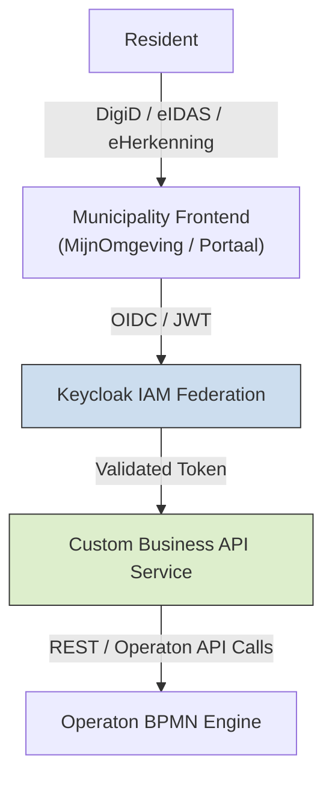

# Operaton BPMN Business API Overview

This document summarizes the discussion starting from the question about offering Operaton BPMN engine services to Dutch municipalities, with DigiD-level reliability, and outlines a reference architecture for implementing the Business API layer using Keycloak and a custom backend service.

---

## 1. Context

- Operaton BPMN engine is running on an Azure VM.
- Goal: Offer BPMN services to municipalities in the Netherlands.
- Requirement: Highest level of reliability, compatible with DigiD/eIDAS/eHerkenning authentication.
- Challenge: Multiple municipalities with their own IAMs, audits, and legal compliance.

The classical integration pattern discussed:

```
Resident
   ↓
Municipality Frontend (MijnOmgeving / Portaal)
   ↓  (DigiD, eIDAS, eHerkenning)
IAM / Access Gateway (Keycloak / ForgeRock / Azure AD B2C / OneWelcome)
   ↓  (OIDC / JWT / signed claims)
Business API Layer
   ↓  (REST / events)
Operaton BPMN Engine
```

The focus is on understanding and implementing the **Business API layer**.

---

## 2. Business API Layer Explained

The Business API layer is **not Operaton's native REST API**. Its purpose is to provide a secure, audited, multi-tenant-friendly interface between municipality IAM systems and the BPMN engine.

### Responsibilities

1. **Token Validation**: Validate OIDC/JWT tokens from municipality IAMs.
2. **Claims Mapping**: Convert authenticated user claims (roles, mandate, assurance level) into process variables.
3. **Authorization**: Enforce per-municipality, per-process access rules.
4. **Tenant Isolation**: Ensure that multiple municipalities cannot access each other's workflows.
5. **Process Invocation**: Call Operaton REST API endpoints securely.
6. **Audit Logging**: Record all actions with compliance-grade logs.
7. **API Simplification**: Expose clean, versioned endpoints:
   - POST /process/vergunning/start
   - POST /task/{id}/complete
   - GET /process/{id}/status

### Example Flow

```
Resident logs in → MijnOmgeving portal
   ↓ OIDC token
Business API validates token
   ↓ Maps token → process variables
   Calls Operaton REST API:
       POST /process-definition/key/vergunning/start
       payload = {
           initiator: "resident-opaque-id",
           municipality: "Utrecht",
           assurance: "hoog"
       }
   Receives process instance ID
Returns process instance info back to portal
```

---

## 3. Open Source Options for the Business API Layer

While no full OSS solution exists to implement the Business API layer completely, components can be combined:

- **Keycloak**: Identity broker, federation of DigiD/eIDAS, JWT/OIDC issuance
- **Custom Backend Service**: Node.js, Go, or Spring Boot service to:
  - Validate JWTs
  - Map claims to process variables
  - Invoke Operaton REST API
  - Log actions
  - Enforce authorization policies

Optional but recommended for future expansion:
- **API Gateway** (Kong, KrakenD, Tyk) for rate limiting, logging, route management
- **Policy Engine** (OPA) for complex authorization rules
- **Event Bus** (Kafka/NATS) for async events

---

## 4. Recommended Architecture (Preferred Option)

We focus on **Keycloak → Custom Business API → Operaton**, skipping a separate API gateway.

### Reference Architecture Diagram



### Flow Summary

1. Resident authenticates via municipality frontend.
2. Keycloak federates and issues JWT/OIDC tokens.
3. Business API validates tokens, maps claims, enforces tenant isolation and authorization.
4. Business API calls Operaton REST API securely with mapped process variables.
5. Operaton executes workflows; Business API returns process state/results.

---

## 5. Key Considerations for High Reliability

- Operaton never sees raw DigiD credentials.
- JWTs contain assurance level (`loa`), role, and mandate.
- Business API enforces all authorization and tenant separation.
- All actions are logged for auditing.
- Multi-municipality use is supported by logical tenant separation.
- The system is compatible with compliance audits (BIO, NEN 7510, AVG/GDPR).

---

## 6. Summary

- **Operaton + Keycloak + Custom Business API** is a valid architecture for offering BPMN services to municipalities.
- Keycloak handles identity federation and token issuance.
- The Business API handles claims mapping, authorization, tenant isolation, and secure Operaton calls.
- Skipping a separate API gateway simplifies deployment while still meeting reliability and audit requirements.
- Future extensions can include event-driven triggers, policy engines, and API gateways if needed.

---

*This document serves as a reference for implementing a compliant, secure, and reliable BPMN service for Dutch municipalities using open-source components.*

